# Guía de Demostración — Cargador de Planilla

Esta guía recorre cada pantalla del sistema paso a paso, dirigida al personal de RR.HH. o planilla sin conocimientos técnicos.

**Archivo de datos de prueba:** `docs/demo-data/demo-reporte.csv`

> **Modo demostración activo:** el sistema está configurado con `demo.mode=true`, por lo que el envío final **no** escribe en la base de datos de producción. Todos los cálculos y pantallas funcionan con normalidad; solo se omite la llamada al servidor de nómina.

---

## Empleados en el archivo de demostración

| ID | Nombre | Turno asignado | Escenario |
|----|--------|---------------|-----------|
| 201 | García López María Elena | Mañana | Sin problemas — envío limpio |
| 202 | Ramírez Fuentes Carlos Alberto | Tarde | Turno incorrecto detectado (SHIFT_MISMATCH) |
| 203 | Sajquiy Tum Pedro Antonio | Mañana | Salida faltante un día (MISSING_EXIT) |
| 204 | Chávez Morales Ana Lucía | Mañana | Día corto (SHORT_DAY) |
| 205 | Tzoc Cux Miguel Ángel | Noche | Turno nocturno cruzando medianoche |
| 206 | Ajú Pop Rosa Elvira | Mañana | Trabajo en día festivo (30 de junio) |

---

## Paso 1 — Pantalla principal

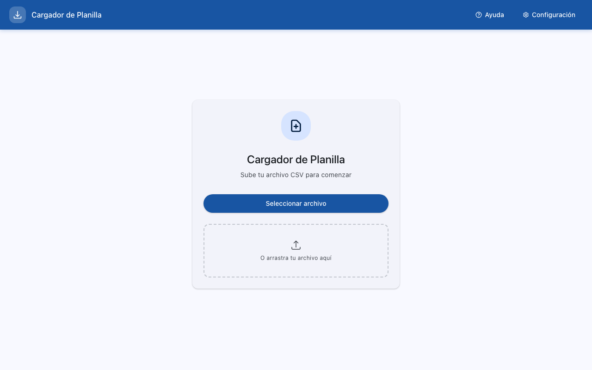

Al abrir la aplicación se muestra la pantalla de inicio con el botón **"Nueva carga"** en la barra superior.

- **→ Botón "Nueva carga":** inicia el proceso de carga de un nuevo reporte TAS.
- El área central muestra el historial de cargas anteriores o un mensaje indicando que no hay cargas previas.

---

## Paso 2 — Selección del archivo CSV

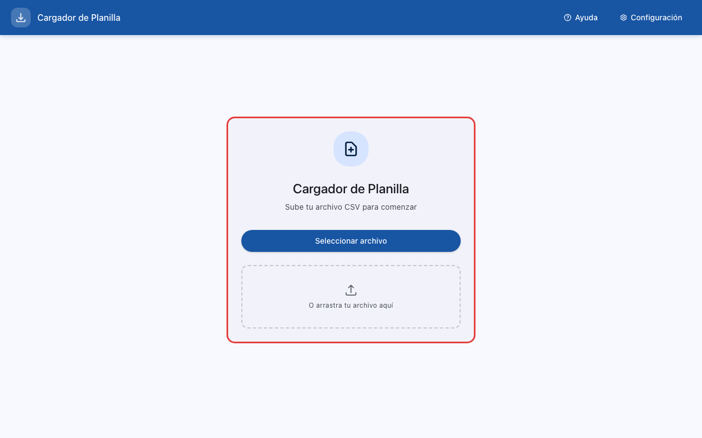

Al hacer clic en **"Nueva carga"** se abre el explorador de archivos del sistema operativo.

- **→ Seleccionar archivo:** navegar hasta la carpeta `docs/demo-data/` y elegir `demo-reporte.csv`.
- El sistema acepta archivos CSV exportados directamente desde el sistema TAS de marcaje facial.

---

## Paso 3 — Progreso de carga

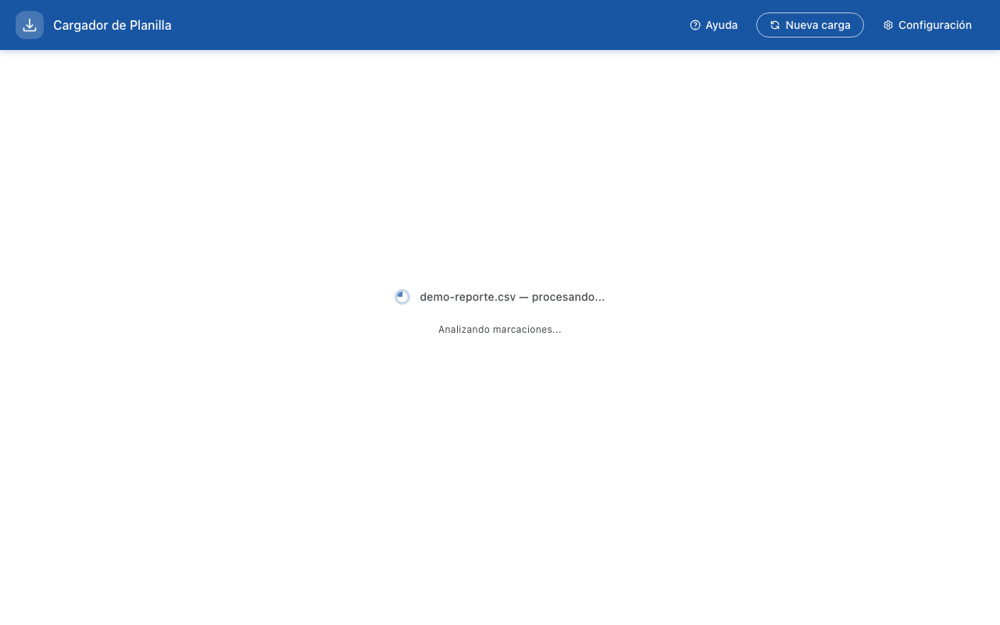

El sistema procesa el archivo y muestra un indicador de progreso mientras analiza cada registro.

- **→ Barra de progreso / ícono giratorio:** indica que el sistema está leyendo y clasificando los marcajes.
- El proceso tarda unos segundos dependiendo del tamaño del archivo.

---

## Paso 4 — Selector de período (quincena)

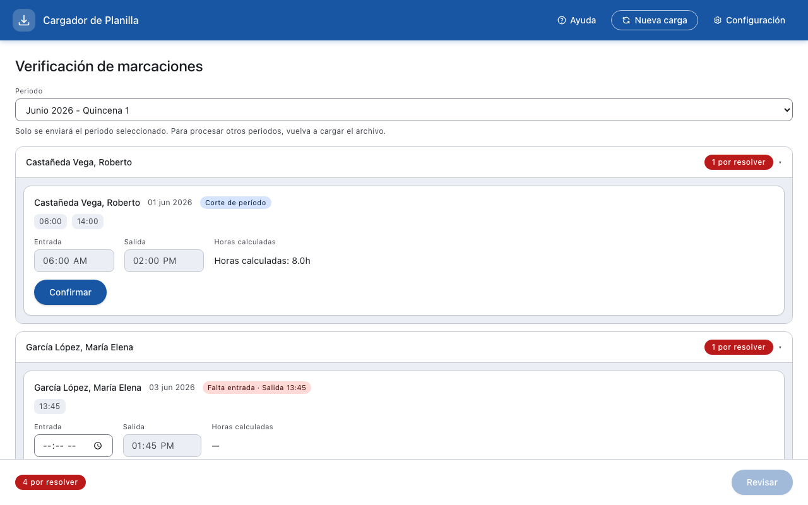

Si el reporte contiene marcajes de más de una quincena, el sistema pregunta cuál quincena se desea procesar.

- **→ Selector "Primera quincena" / "Segunda quincena":** elige el período del 1 al 15 o del 16 al último día del mes.
- **→ Mes y año:** confirman el período seleccionado.
- Para el archivo de demostración, seleccionar **segunda quincena de junio 2026** (del 16 al 30).

---

## Paso 5 — Pantalla de revisión: empleado sin problemas


La pantalla de revisión muestra el resumen de todos los empleados del período seleccionado.

- **→ Fila de García López María Elena (201):** no tiene insignias de advertencia — todos sus días fueron detectados correctamente.
- **→ Columna "Días no laborados":** número de días hábiles en los que el empleado no registró marcaje.
- **→ Columna "H. extras simples":** horas extras en día normal, calculadas automáticamente.
- **→ Columna "H. extras dobles":** horas extras en día festivo o domingo.

---

## Paso 6 — Pantalla de revisión: empleados con alertas

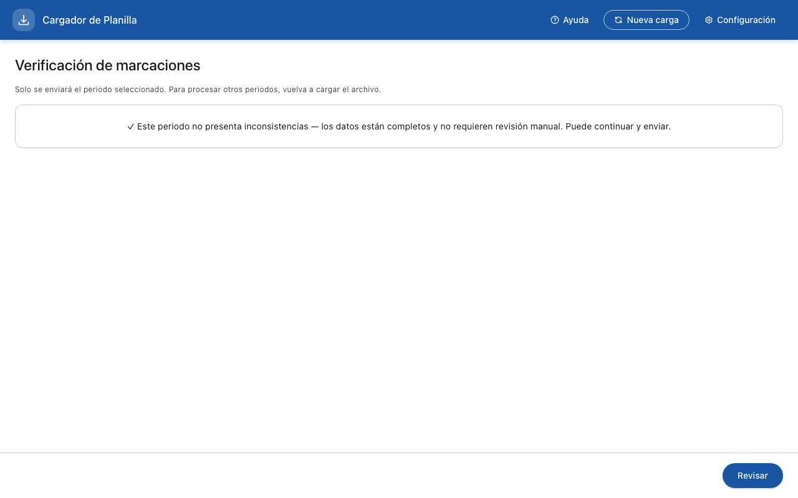

Las filas con problemas detectados muestran insignias de colores junto al nombre del empleado.

- **→ Insignia naranja "MISSING_EXIT":** el empleado Sajquiy Tum (203) no registró salida un día.
- **→ Insignia amarilla "SHORT_DAY":** la empleada Chávez Morales (204) salió muy temprano un día.
- **→ Insignia roja "SHIFT_MISMATCH":** Ramírez Fuentes (202) marcó en un horario diferente al asignado.
- Las filas con insignias rojas o naranja **requieren revisión manual** antes de poder enviar.

---

## Paso 7 — Discordancia de turno auto-detectada

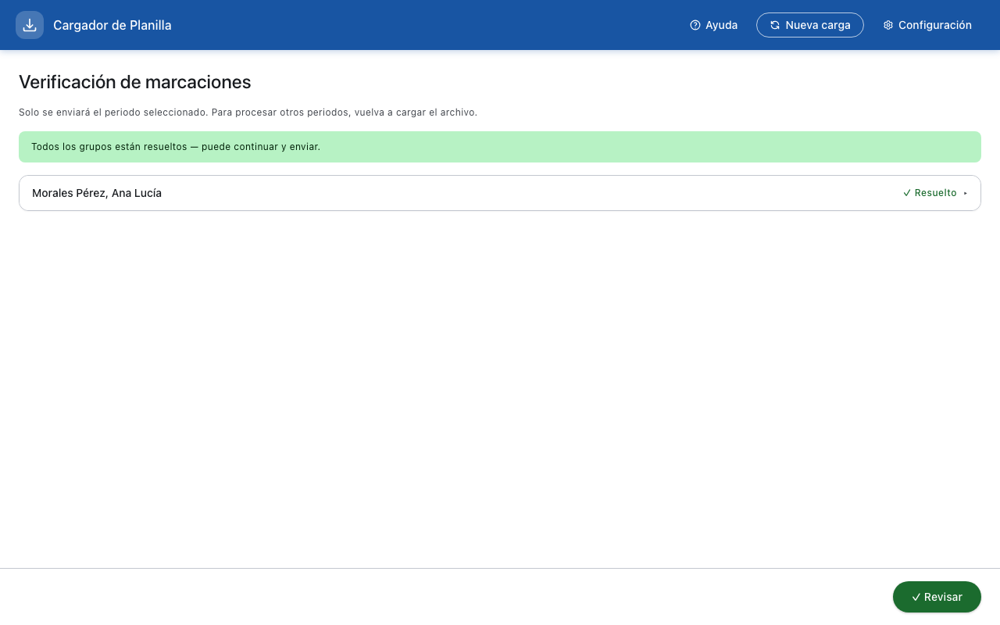

Al hacer clic en la fila de Ramírez Fuentes Carlos Alberto (202) se abre la pantalla de verificación de ese empleado.

- **→ Indicador "Turno asignado: Tarde":** turno registrado en el sistema para este empleado.
- **→ Indicador "Turno detectado: Mañana":** el sistema identificó automáticamente en qué horario trabajó realmente.
- El sistema detectó que sus marcajes corresponden al turno de Mañana aunque esté registrado en Tarde. Se le pide al usuario confirmar si el turno detectado es correcto.

---

## Paso 8 — Pantalla de verificación: ingreso de horas

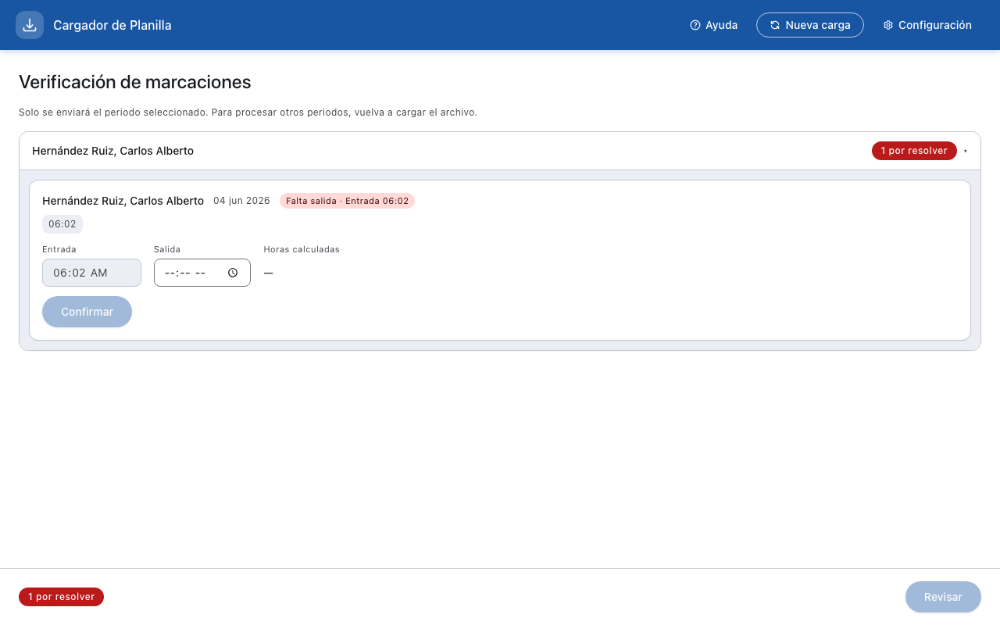

Para los empleados con alertas, la pantalla de verificación permite corregir manualmente la entrada o salida.

- **→ Campo "Entrada":** hora a la que el empleado llegó, en formato HH:MM con selector AM/PM.
- **→ Campo "Salida":** hora a la que el empleado se retiró.
- **→ Píldora de turno:** muestra el turno al que corresponde la sesión (Mañana, Tarde o Noche).
- Ingresar los valores correctos y hacer clic en **"Confirmar"** para resolver la alerta.

---

## Paso 9 — Verificación: turno nocturno (cruce de medianoche)

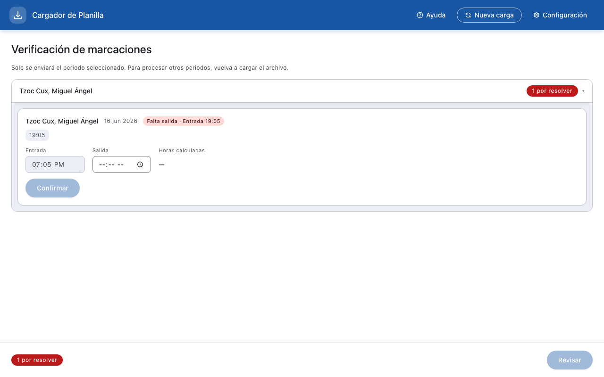

El empleado Tzoc Cux Miguel Ángel (205) trabaja en el turno Noche, que comienza antes de medianoche y termina al día siguiente.

- **→ Hora de entrada:** 7:05 PM del día de inicio (ej. lunes 18 de junio).
- **→ Hora de salida:** 7:03 AM del día siguiente — el campo muestra "AM" porque la salida ocurre en la madrugada del martes.
- **→ Indicador "Turno Noche":** confirma que la sesión cruza la medianoche y el cálculo de horas es correcto.

---

## Paso 10 — Confirmación de envío

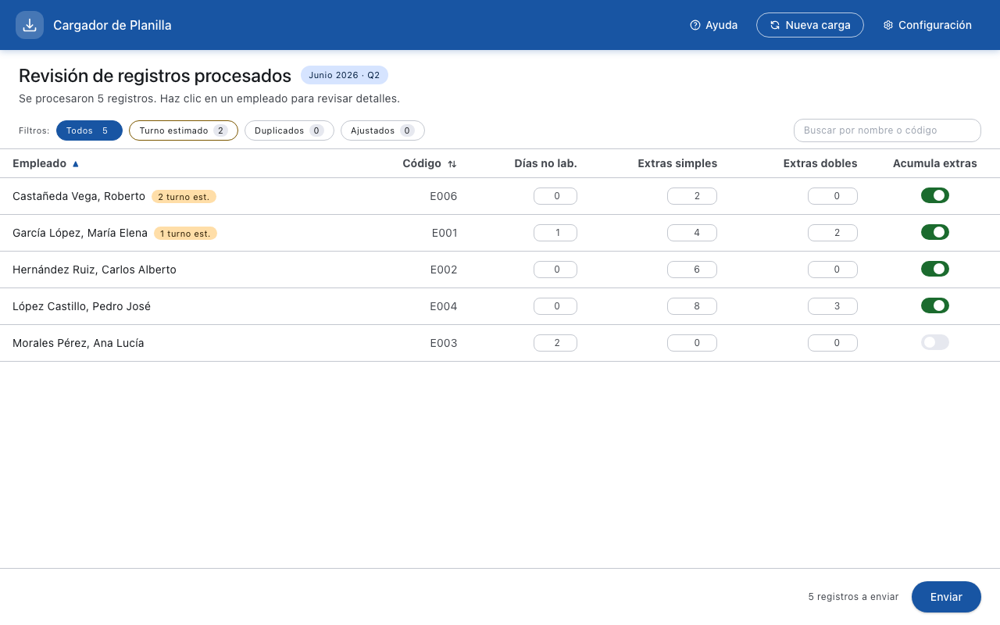

Una vez revisadas y resueltas todas las alertas, aparece el botón **"Enviar"**. Al hacer clic se muestra un diálogo de confirmación.

- **→ Diálogo de confirmación:** muestra un resumen del período y cantidad de empleados a enviar.
- **→ Botón "Enviar":** envía los datos al servidor de nómina. Esta acción no se puede deshacer.
- **→ Botón "Cancelar":** regresa a la pantalla de revisión sin enviar nada.

---

## Paso 11 — Pantalla de éxito

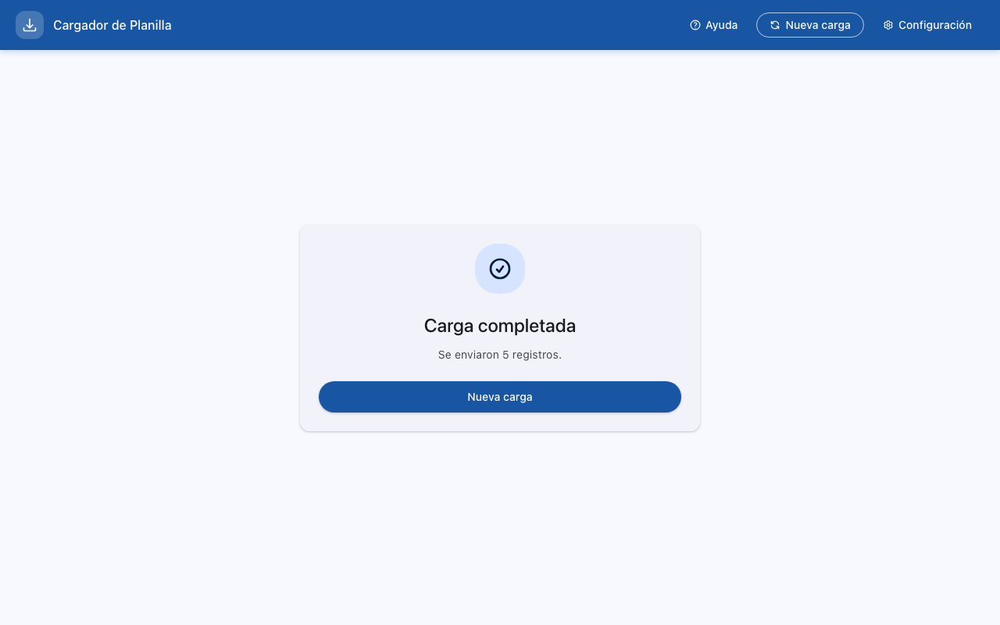

Al completarse el envío, el sistema muestra una pantalla verde de confirmación.

- **→ Ícono de palomita verde:** confirma que los datos fueron enviados correctamente al servidor de nómina.
- **→ Mensaje de resumen:** indica cuántos empleados fueron procesados y el período correspondiente.
- **→ Protección contra duplicados:** si se intenta cargar el mismo período dos veces, el sistema lo detecta y bloquea el reenvío automáticamente.

---

## Paso 12 — Configuración: pestaña Turnos

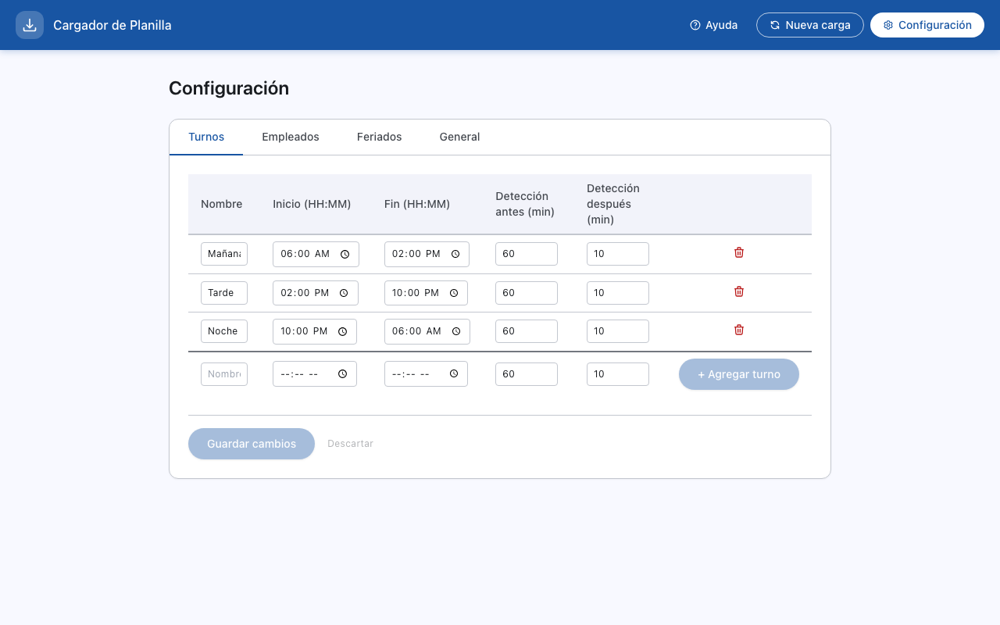

La página de Configuración (ícono de engranaje) permite administrar los parámetros del sistema. La pestaña **Turnos** muestra los horarios activos.

- **→ Lista de turnos:** Mañana (7:00–15:00), Tarde (15:00–23:00) y Noche (19:00–7:00).
- **→ Ventana de detección (antes / después):** minutos antes y después de la hora de inicio en que se reconoce una marcaje como apertura de ese turno.
- **→ Botón "Agregar turno":** permite crear un nuevo turno personalizado.
- **→ Botón de edición:** permite modificar el nombre, horario y ventana de detección de un turno existente.

---

## Paso 13 — Configuración: pestaña Empleados

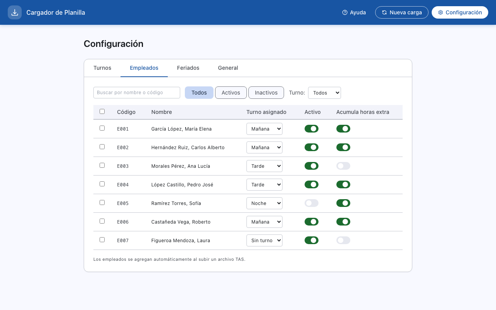

La pestaña **Empleados** muestra el registro de todos los colaboradores que han marcado en el sistema.

- **→ Columna "Turno asignado":** turno registrado para cada empleado; afecta la detección de discordancias.
- **→ Columna "Acumula H. Extras":** si está activo, el sistema calcula y reporta las horas extras; si está desactivado, las horas extras se omiten del reporte.
- **→ Toggle activo/inactivo:** marca a un empleado como inactivo para excluirlo de futuros reportes sin eliminarlo del registro.

---

## Paso 14 — Configuración: pestaña Feriados

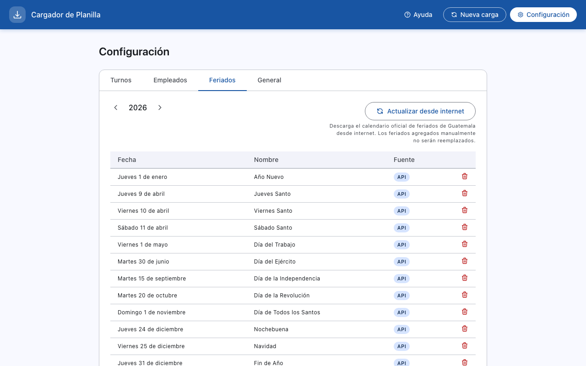

La pestaña **Feriados** lista los días no laborales que afectan el cálculo de horas dobles.

- **→ Lista de feriados:** días festivos con su nombre oficial (ej. "Día del Ejército" — 30 de junio).
- **→ Botón "Actualizar desde API":** descarga automáticamente los feriados oficiales de Guatemala para el año en curso.
- **→ Botón "Agregar feriado":** permite registrar manualmente un día festivo local o empresarial.

---

## Paso 15 — Configuración: pestaña General

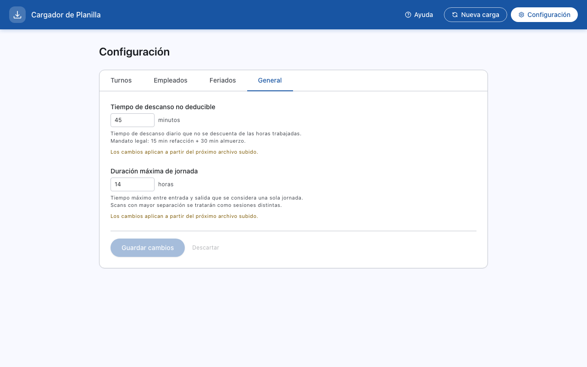

La pestaña **General** contiene parámetros globales que afectan todos los cálculos.

- **→ "Tiempo de descanso permitido (minutos)":** minutos de pausa que el sistema descuenta del tiempo trabajado antes de computar horas extras (valor predeterminado: 45 min).
- **→ "Duración máxima de sesión (minutos)":** si la diferencia entre dos marcajes del mismo empleado supera este valor, el sistema los trata como dos sesiones separadas en lugar de una sola.

---

## Paso 16 — Botón de ayuda: manual en PDF

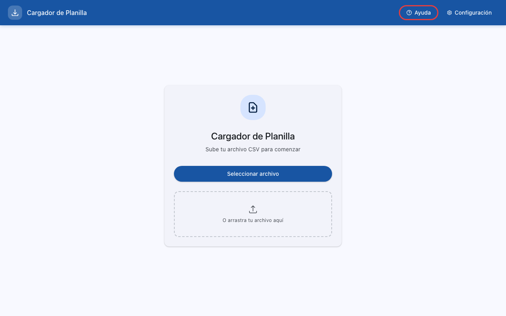

El ícono de interrogación (?) en la barra superior abre el manual de usuario en formato PDF.

- **→ Botón "?":** abre el manual completo dentro de la propia aplicación, sin necesidad de conexión a internet.
- El manual cubre todos los flujos de trabajo, mensajes de error y preguntas frecuentes.

---

## Capturas de pantalla

Las imágenes en `demo-data/screenshots/` son generadas automáticamente por el script de Playwright (`e2e/demo-screenshots.spec.ts`) ejecutado con mocks de API. Para regenerarlas:

```bash
cd frontend && npx playwright test e2e/demo-screenshots.spec.ts
```
