# Manual de Usuario — Cargador de Planilla

**Idioma:** Español
**Dirigido a:** Personal de planillas y recursos humanos

---

## Contenido

1. [¿Qué hace esta aplicación?](#1-qué-hace-esta-aplicación)
2. [Requisitos del sistema](#2-requisitos-del-sistema)
3. [Cómo abrir la aplicación](#3-cómo-abrir-la-aplicación)
4. [Flujo de uso completo](#4-flujo-de-uso-completo)
   - [Paso 1: Cargar archivo TAS](#paso-1-cargar-archivo-tas)
   - [Paso 2: Empleados inactivos](#paso-2-empleados-inactivos-si-aplica)
   - [Paso 3: Verificación de marcaciones](#paso-3-verificación-de-marcaciones)
   - [Paso 4: Revisar datos finales](#paso-4-revisar-datos-finales)
   - [Paso 5: Enviar a la base de datos](#paso-5-enviar-a-la-base-de-datos)
5. [Pantalla de resultados](#5-pantalla-de-resultados)
6. [Empleados sin marcaciones](#6-empleados-sin-marcaciones)
7. [Página de Configuración](#7-página-de-configuración)
8. [Mensajes de error y soluciones](#8-mensajes-de-error-y-soluciones)
9. [Resolución de problemas](#9-resolución-de-problemas)
10. [Preguntas frecuentes](#10-preguntas-frecuentes)
11. [Glosario](#11-glosario)

---

## 1. ¿Qué hace esta aplicación?

El **Cargador de Planilla** procesa los archivos de marcaciones de asistencia generados por el sistema TAS (Terminal de Asistencia), detecta situaciones que requieren su atención (entradas faltantes, turnos incorrectos, jornadas cortas, etc.), y envía los datos de planilla a la base de datos de la empresa.

En resumen, la aplicación:

1. Lee el archivo CSV exportado del sistema TAS.
2. Analiza las marcaciones de cada empleado y las agrupa en sesiones de trabajo (entrada y salida).
3. Detecta situaciones irregulares y le pide que las revise antes de continuar.
4. Calcula horas trabajadas, días no laborados y horas extras.
5. Le permite revisar y ajustar los datos antes de enviarlos.
6. Envía los registros finales a la base de datos de la empresa.

---

## 2. Requisitos del sistema

- **Sistema operativo:** Windows 10 o Windows 11
- **Conexión a la red:** La computadora debe tener acceso a la red interna de la empresa (donde se encuentra la base de datos)
- **Archivo CSV:** El reporte de marcaciones generado por el sistema TAS, en formato `.csv`

No se requiere instalación de programas adicionales. La aplicación incluye todo lo necesario.

---

## 3. Cómo abrir la aplicación

Haga doble clic en el ícono de **Cargador de Planilla** en el escritorio o en la carpeta donde fue instalada la aplicación.

La aplicación tardará unos segundos en iniciarse mientras prepara sus componentes internos. Una vez lista, aparecerá la pantalla de inicio donde podrá cargar su archivo.

### Si aparece "No se pudo conectar con el servicio"

Si al abrir la aplicación ve el mensaje **"No se pudo conectar con el servicio."** en rojo, significa que el componente interno de la aplicación no se inició correctamente.

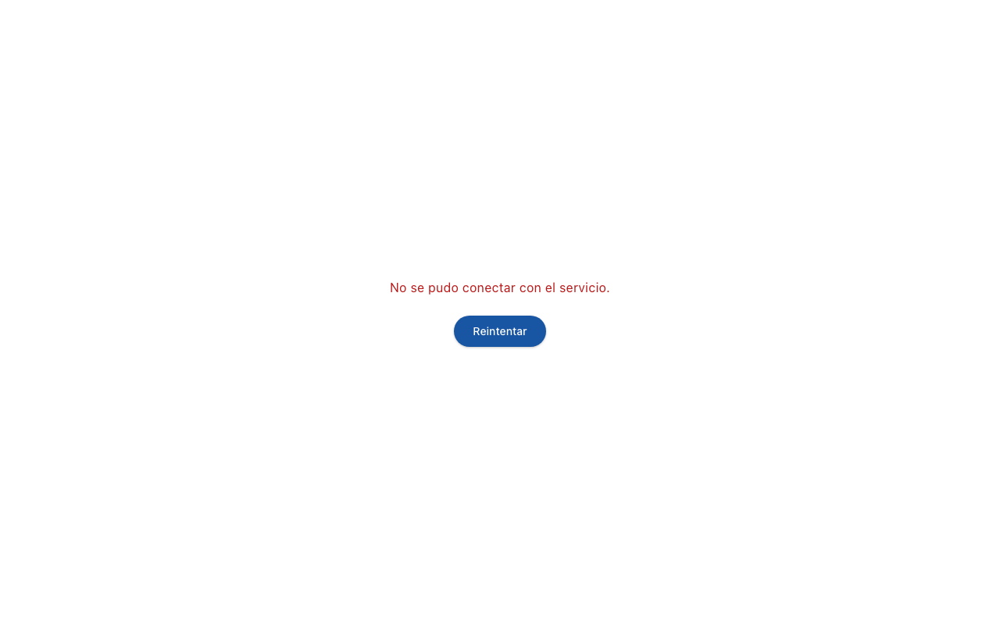

**Qué hacer:**

1. Haga clic en el botón **"Reintentar"** para intentar conectar de nuevo.
2. Si el problema persiste después de varios intentos, cierre la aplicación completamente y vuelva a abrirla.
3. Si aún no funciona, contacte al encargado de sistemas.

---

## 4. Flujo de uso completo

### Paso 1: Cargar archivo TAS

Al abrir la aplicación, verá la pantalla de inicio con dos opciones para cargar su archivo CSV:

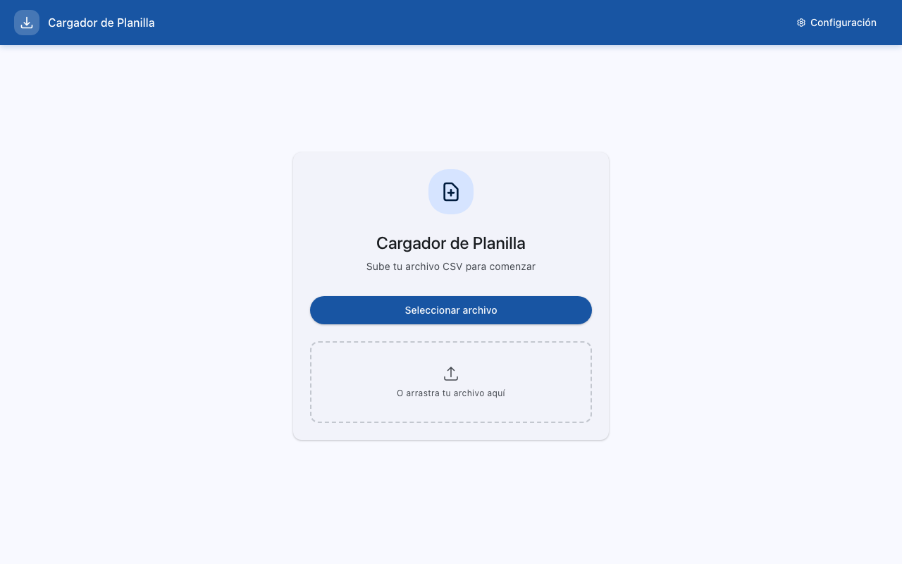

#### Opción A: Seleccionar archivo con el botón

1. Haga clic en el botón **"Seleccionar archivo"**.
2. Se abrirá una ventana del sistema para buscar archivos.
3. Navegue hasta la carpeta donde tiene guardado su reporte TAS.
4. Seleccione el archivo `.csv` y haga clic en **Abrir**.

#### Opción B: Arrastrar y soltar

1. Abra la carpeta donde tiene guardado su archivo de reporte TAS.
2. Haga clic sobre el archivo y, sin soltar el botón del mouse, arrástrelo hasta el área punteada que dice **"O arrastra tu archivo aquí"**.
3. Suelte el archivo sobre esa área.

#### Qué esperar después de cargar

La aplicación procesará el archivo automáticamente. Verá una pantalla de progreso con el nombre del archivo y el mensaje **"Analizando marcaciones..."**.

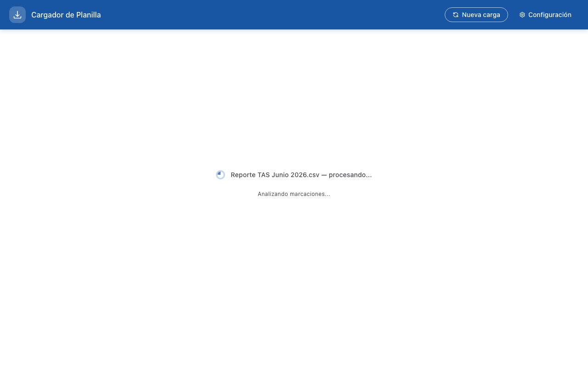

El procesamiento tarda unos segundos. Durante este tiempo la aplicación lee todas las marcaciones del archivo, identifica a cada empleado, agrupa las marcaciones en sesiones de trabajo y detecta situaciones que necesitan revisión.

---

### Paso 2: Empleados inactivos (si aplica)

> **Nota:** Este paso solo aparece si el archivo TAS contiene marcaciones de empleados que están marcados como inactivos en el sistema.

Si la aplicación detecta empleados inactivos con marcaciones en el archivo, verá la siguiente pantalla:

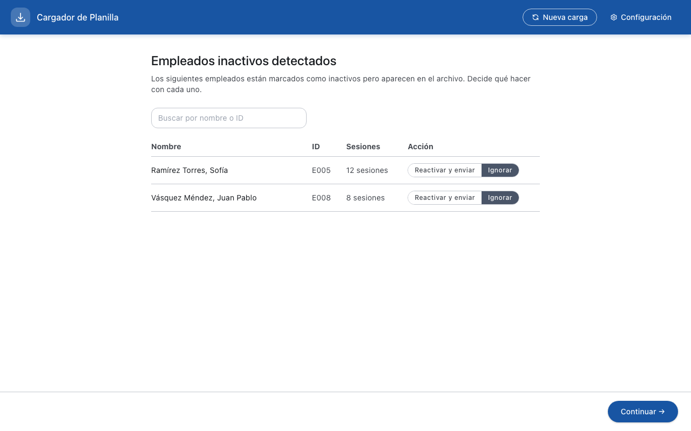

Un empleado **inactivo** es alguien que fue desactivado previamente en la configuración de la aplicación (por ejemplo, porque dejó de trabajar en la empresa). Si aparece en el archivo TAS, significa que esa persona marcó asistencia durante el período.

Para cada empleado inactivo, tiene dos opciones:

| Botón | Qué hace |
|-------|----------|
| **Reactivar y enviar** | Activa al empleado nuevamente y procesa sus marcaciones junto con las de los demás empleados |
| **Ignorar** | Descarta las marcaciones de ese empleado — no serán enviadas a la base de datos |

Puede buscar empleados por nombre o código usando la barra de búsqueda en la parte superior.

Cuando haya decidido qué hacer con cada empleado, haga clic en **"Continuar"** en la esquina inferior derecha.

---

### Paso 3: Verificación de marcaciones

La pantalla de verificación muestra todas las situaciones que la aplicación detectó como irregulares. Cada situación requiere que usted la revise y confirme antes de continuar.

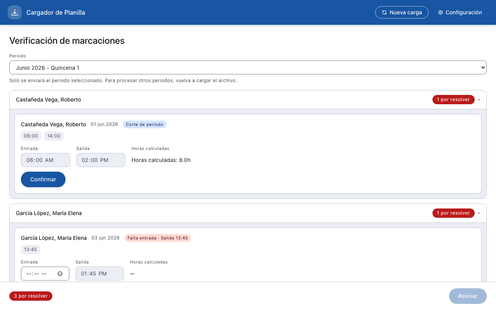

Cada empleado con situaciones pendientes aparece en una tarjeta con una etiqueta roja que indica cuántas situaciones quedan **"por resolver"**. Dentro de cada tarjeta se muestra la situación específica con los detalles de la marcación.

A continuación se explica cada tipo de situación que puede encontrar:

#### Falta entrada

**Etiqueta:** `Falta entrada · Salida HH:MM`

El sistema encontró una o más marcaciones de salida para ese día, pero no encontró ninguna marcación de entrada. Necesita completar la hora de entrada.

**Qué hacer:**
1. Revise las marcaciones originales (las pastillas azules debajo de la etiqueta) para entender el contexto.
2. Ingrese la hora de entrada correcta en el campo **"Entrada"** (el campo muestra `--:-- --` cuando está vacío).
3. Haga clic en **"Confirmar"**.

#### Falta salida

**Etiqueta:** `Falta salida · Entrada HH:MM`

El sistema encontró una marcación de entrada pero no encontró la marcación de salida correspondiente. Necesita completar la hora de salida.

**Qué hacer:**
1. Revise las marcaciones originales para entender el contexto.
2. Ingrese la hora de salida correcta en el campo **"Salida"**.
3. Haga clic en **"Confirmar"**.

#### Cambio de turno

**Etiqueta:** `Cambio de turno`

Las marcaciones del empleado coinciden con un turno diferente al que tiene asignado. Por ejemplo, si el empleado tiene asignado el turno "Mañana" pero sus marcaciones corresponden al turno "Tarde".

**Qué hacer:**
1. Revise qué turno detectó el sistema y compárelo con el turno asignado.
2. Seleccione el turno correcto que desea aplicar para ese día.
3. Haga clic en **"Confirmar"**.

#### Doble marcación

**Etiqueta:** `Doble marcación`

El sistema detectó dos sesiones de trabajo diferentes para el mismo empleado en el mismo día. Esto puede ocurrir cuando un empleado marca salida y luego vuelve a marcar entrada el mismo día.

**Qué hacer:**
1. Revise ambas sesiones detectadas.
2. Decida si desea conservar una de las dos sesiones o mantener ambas.
3. Haga clic en **"Confirmar"**.

#### Jornada corta

**Etiqueta:** `Jornada corta`

El empleado salió significativamente antes de lo esperado según su turno asignado. La aplicación le muestra la sesión detectada para que pueda revisarla.

**Qué hacer:**
1. Revise las horas de entrada y salida detectadas.
2. Si la salida temprana es correcta, confirme la sesión tal como está.
3. Si la hora de salida es incorrecta, corrija el campo **"Salida"** con la hora correcta.
4. Haga clic en **"Confirmar"**.

#### Corte de período

**Etiqueta:** `Corte de período`

La sesión de trabajo del empleado cruza el límite entre dos quincenas (por ejemplo, entrada el día 15 y salida el día 16). La aplicación asigna la sesión al período que contiene la mayor parte de las horas trabajadas.

**Qué hacer:**
1. Revise las horas de entrada y salida que muestra el sistema.
2. Verifique que la asignación al período es correcta.
3. Haga clic en **"Confirmar"**.

#### Turno estimado

**Etiqueta:** `Turno estimado` (se muestra como pastilla **"est."** de fondo amarillo)

Las marcaciones del empleado no coincidieron con la ventana de detección de ningún turno configurado. La aplicación asignó automáticamente el turno más cercano en horario. Estos días se resaltarán con fondo amarillo en pantallas posteriores como recordatorio.

**Qué hacer:**
1. Revise el turno asignado automáticamente y las horas de entrada/salida.
2. Si el turno asignado es correcto, confirme.
3. Si desea cambiar el turno, seleccione el correcto antes de confirmar.
4. Haga clic en **"Confirmar"**.

#### Selector de período

Cuando el archivo TAS abarca más de una quincena, aparece un menú desplegable en la parte superior de la pantalla que le permite elegir qué período procesar (por ejemplo, "Junio 2026 - Quincena 1").

Solo se procesará y enviará el período seleccionado. Para procesar otros períodos del mismo archivo, deberá volver a cargar el archivo y seleccionar el período correspondiente.

#### Cuando todo está confirmado

Una vez que haya revisado y confirmado todas las situaciones, aparecerá un banner verde con el mensaje **"Todos los grupos están resueltos — puede continuar y enviar."** Cada empleado mostrará la etiqueta verde **"Resuelto"**.

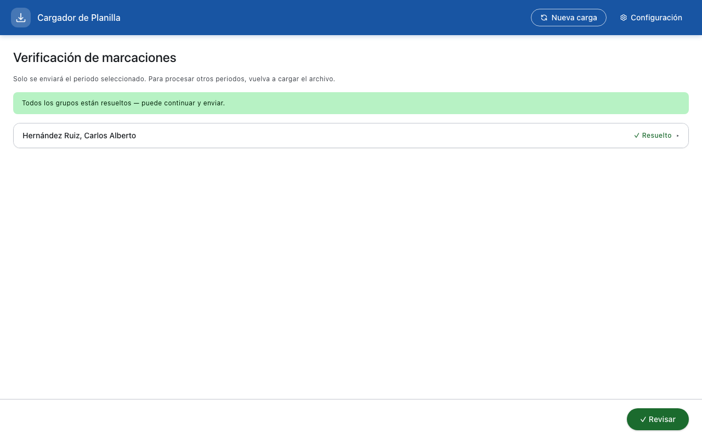

Haga clic en el botón **"Revisar"** (ahora habilitado en verde) en la esquina inferior derecha para avanzar al siguiente paso.

---

### Paso 4: Revisar datos finales

Después de la verificación, la aplicación muestra un resumen con los datos calculados de cada empleado. Esta pantalla tiene dos vistas: la **vista de lista** y la **vista de detalle**.

#### Vista de lista

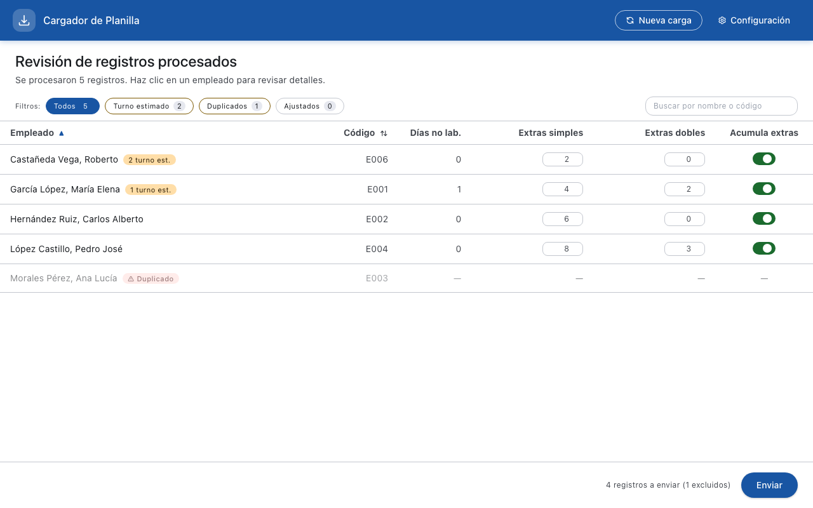

La tabla muestra un registro por cada empleado con las siguientes columnas:

| Columna | Descripción |
|---------|-------------|
| **Empleado** | Nombre del empleado. Puede incluir etiquetas como "turno est." (naranja) o "Duplicado" (rojo) |
| **Código** | Código del empleado en el sistema |
| **Días no lab.** | Cantidad de días que el empleado no trabajó en el período (campo editable) |
| **Extras simples** | Horas extras simples calculadas (campo editable) |
| **Extras dobles** | Horas extras dobles calculadas (campo editable) |
| **Acumula extras** | Interruptor para indicar si el empleado acumula horas extra |

##### Filtros

En la parte superior de la tabla hay botones de filtro con contadores:

- **Todos** — Muestra todos los empleados procesados
- **Turno estimado** — Muestra solo empleados que tienen al menos un día con turno estimado (asignado automáticamente)
- **Duplicados** — Muestra solo empleados cuyo registro ya existe en la base de datos
- **Ajustados** — Muestra solo empleados con algún valor modificado manualmente (días no laborados u horas extras)

##### Búsqueda y ordenamiento

- Use la barra de búsqueda **"Buscar por nombre o código"** a la derecha para filtrar empleados.
- Haga clic en el encabezado de cualquier columna para ordenar la tabla. La flecha junto al nombre de la columna indica el orden actual.

##### Etiquetas especiales

- **Turno est.** (naranja): Indica que ese empleado tiene uno o más días donde el turno fue asignado automáticamente porque las marcaciones no coincidieron con ningún turno configurado. El número indica cuántos días tienen turno estimado (por ejemplo, "2 turno est.").
- **Duplicado** (rojo): Indica que el registro de ese empleado ya existe en la base de datos para el mismo período. La fila aparece atenuada y sus datos no son editables. El registro duplicado será excluido automáticamente al enviar.

##### Editar campos en la tabla

Los campos de **Días no lab.**, **Extras simples** y **Extras dobles** son editables directamente en la tabla. Haga clic sobre el campo, modifique el valor y presione Enter o haga clic fuera para confirmar. El campo modificado se resaltará con un borde azul y mostrará el valor original entre paréntesis (por ejemplo, "era 3"). Los cambios solo aplican a la sesión de carga actual.

##### Interruptor "Acumula extras"

Cada empleado tiene un interruptor que indica si acumula horas extras. Si está desactivado (gris), las horas extras de ese empleado no se enviarán a la base de datos. Puede activarlo o desactivarlo haciendo clic sobre él.

##### Barra inferior

En la parte inferior de la pantalla verá el conteo de registros que se enviarán (por ejemplo, "4 registros a enviar (1 excluidos)") y el botón **"Enviar"**.

#### Vista de detalle

Haga clic en cualquier fila de empleado para ver su información detallada.

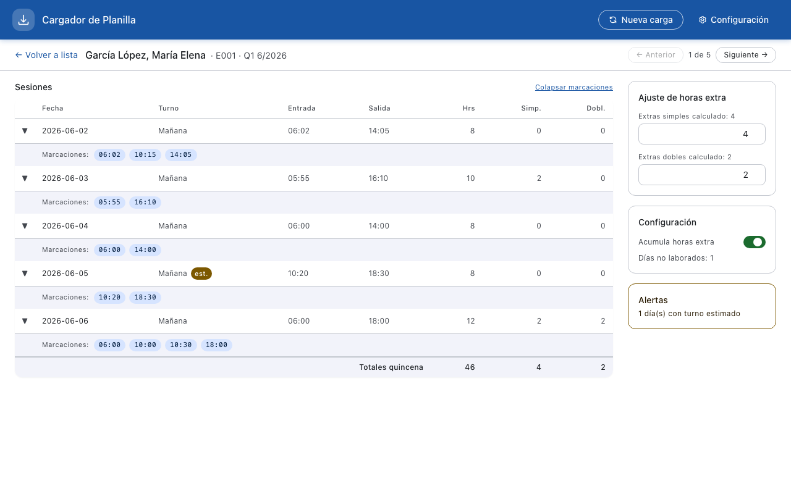

##### Navegación

- **"Volver a lista"** (esquina superior izquierda): regresa a la vista de lista.
- **"Anterior" / "Siguiente"** (esquina superior derecha): navega entre empleados sin regresar a la lista.
- **"1 de 5"**: indicador de posición actual entre el total de empleados.

##### Encabezado

Muestra el nombre del empleado, su código (por ejemplo, "E001") y el período (por ejemplo, "Q1 6/2026" para Quincena 1 de Junio 2026).

##### Tabla de sesiones

La tabla muestra cada día trabajado con las siguientes columnas:

| Columna | Descripción |
|---------|-------------|
| **Fecha** | Fecha de la sesión de trabajo |
| **Turno** | Turno asignado para ese día |
| **Entrada** | Hora de entrada |
| **Salida** | Hora de salida |
| **Hrs** | Total de horas trabajadas ese día |
| **Simp.** | Horas extras simples de ese día |
| **Dobl.** | Horas extras dobles de ese día |

Al final de la tabla aparece una fila de **"Totales quincena"** con la suma de horas, extras simples y extras dobles.

##### Marcaciones originales (pastillas azules)

Cada fila de sesión se puede expandir haciendo clic en la flecha a la izquierda. Al expandir, se muestran las marcaciones originales del sistema TAS como pastillas azules con la hora exacta (por ejemplo, `06:02`, `10:15`, `14:05`). Esto le permite verificar que las horas de entrada y salida calculadas corresponden a las marcaciones reales.

Puede hacer clic en **"Colapsar marcaciones"** en la esquina superior derecha de la tabla para cerrar todas las marcaciones expandidas.

##### Indicador de turno estimado

Los días donde el turno fue asignado automáticamente (turno estimado) se muestran con:
- Una pastilla amarilla **"est."** junto al nombre del turno en la columna Turno.
- La fila del día tiene un fondo ligeramente amarillo.
- Las marcaciones originales de ese día se muestran con pastillas rojas en lugar de azules.

##### Panel lateral derecho

A la derecha de la tabla de sesiones encontrará tres secciones:

**Ajustes manuales:**
- Muestra campos editables para corregir los valores calculados por el sistema antes de enviar.
- **Días no laborados:** número de días en la quincena en que el empleado no registró asistencia, calculado automáticamente. Si el valor está incorrecto (por ejemplo, por un día festivo no configurado), puede corregirlo aquí. El cambio aplica únicamente a la sesión de carga actual; la próxima carga calculará el valor de nuevo desde los registros de marcación.
- **Extras simples / Extras dobles:** horas extra calculadas por el sistema. Puede corregirlos si es necesario.
- Si modifica algún valor, el campo se resaltará en amarillo para indicar que fue ajustado manualmente.

**Configuración:**
- **Acumula horas extra:** Interruptor para activar o desactivar si el empleado acumula horas extras.

**Alertas:**
- Si el empleado tiene días con turno estimado, aparece una tarjeta de alerta indicando cuántos días fueron afectados (por ejemplo, "1 día(s) con turno estimado").

---

### Paso 5: Enviar a la base de datos

Cuando haya terminado de revisar y ajustar los datos, haga clic en el botón **"Enviar"** en la barra inferior de la vista de lista.

La barra inferior muestra cuántos registros se enviarán y cuántos serán excluidos (duplicados). Esto le permite verificar la cantidad antes de enviar.

**No cierre la aplicación** mientras el envío está en curso.

> **Nota:** Si la base de datos no está disponible, el botón "Enviar" estará deshabilitado y verá una advertencia. Verifique su conexión a la red y vuelva a intentar.

---

## 5. Pantalla de resultados

Al completarse el envío, verá una pantalla de resultados que indica cómo terminó el proceso.

### Todos los registros enviados correctamente

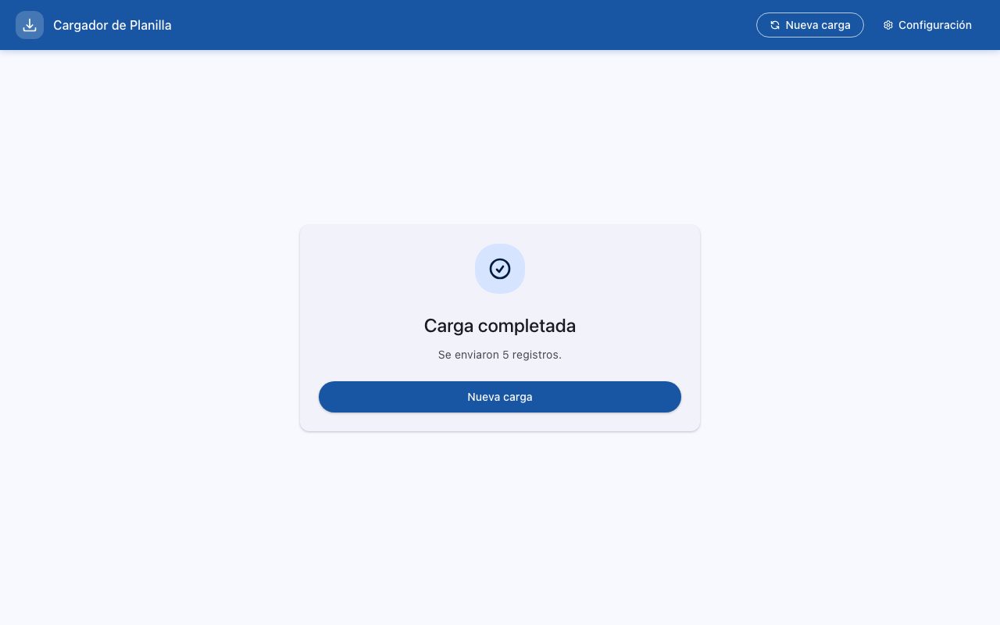

Verá el mensaje **"Carga completada"** con la cantidad de registros enviados (por ejemplo, "Se enviaron 5 registros."). Haga clic en **"Nueva carga"** para procesar otro archivo.

### Envío parcial (algunos registros fallaron)

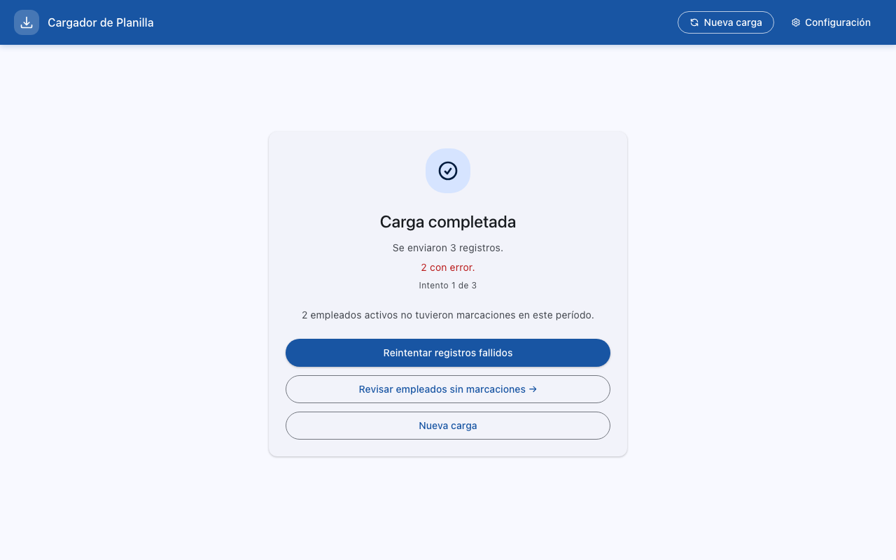

Cuando algunos registros se enviaron correctamente pero otros fallaron, verá:

- La cantidad de registros enviados exitosamente.
- La cantidad de registros **con error** en rojo.
- El número de intento actual (por ejemplo, "Intento 1 de 3").
- Si hay empleados activos sin marcaciones en el período, un aviso correspondiente.

Tiene tres opciones:

| Botón | Qué hace |
|-------|----------|
| **Reintentar registros fallidos** | Vuelve a intentar enviar solo los registros que fallaron |
| **Revisar empleados sin marcaciones** | Abre la pantalla de empleados ausentes (ver sección 6) |
| **Nueva carga** | Descarta los registros fallidos y regresa a la pantalla de inicio |

### Reintentos agotados

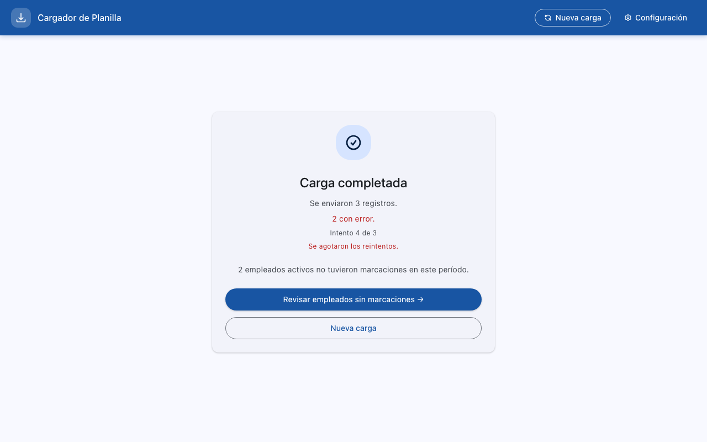

Si después de 3 intentos los registros siguen fallando, verá el mensaje **"Se agotaron los reintentos."** en rojo. Esto generalmente indica un problema con la base de datos.

**Qué hacer:**
1. Si hay empleados sin marcaciones, haga clic en **"Revisar empleados sin marcaciones"** para manejar esa situación.
2. Haga clic en **"Nueva carga"** para comenzar de nuevo.
3. Si el problema persiste, contacte al encargado de sistemas.

---

## 6. Empleados sin marcaciones

Después de un envío exitoso (total o parcial), si existen empleados activos en el sistema que no tuvieron ninguna marcación durante el período procesado, la aplicación le notificará.

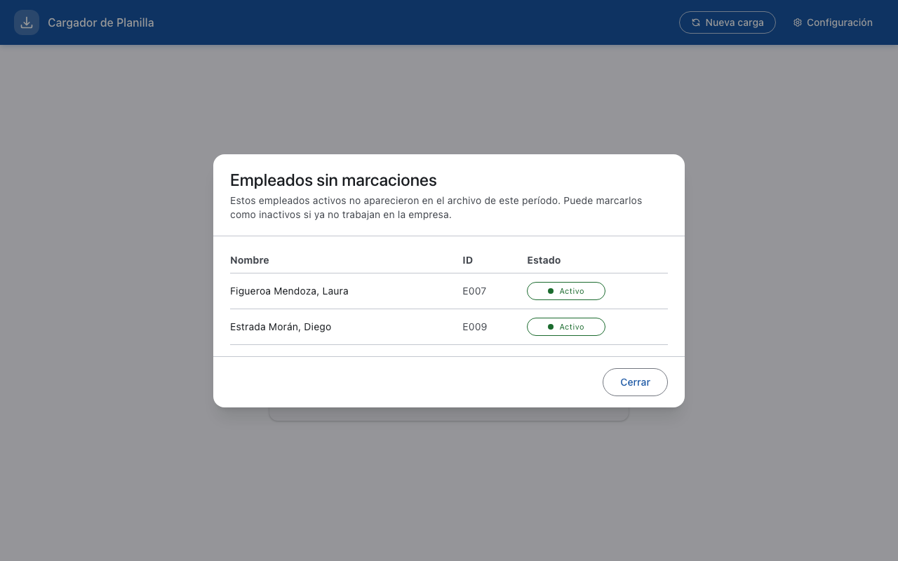

Esta ventana muestra una tabla con:

| Columna | Descripción |
|---------|-------------|
| **Nombre** | Nombre del empleado |
| **ID** | Código del empleado |
| **Estado** | Estado actual del empleado (Activo/Inactivo), con botón para cambiarlo |

Si un empleado no tuvo marcaciones porque ya no trabaja en la empresa, haga clic en el botón de estado para cambiarlo de **Activo** a **Inactivo**. De esta manera, no aparecerá en futuras alertas.

Haga clic en **"Cerrar"** cuando haya terminado de revisar.

---

## 7. Página de Configuración

Para acceder a la configuración, haga clic en **"Configuración"** en la esquina superior derecha de la barra de navegación (visible en todas las pantallas de la aplicación).

La página de configuración tiene cuatro pestañas: **Turnos**, **Empleados**, **Feriados** y **General**.

### Turnos

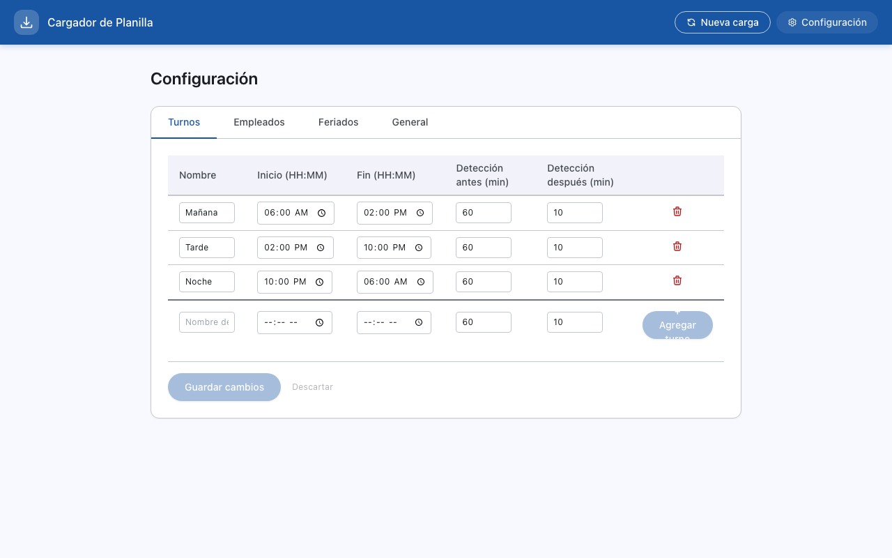

En esta pestaña puede definir y modificar los turnos de trabajo. La tabla muestra:

| Campo | Descripción |
|-------|-------------|
| **Nombre** | Nombre del turno (por ejemplo, "Mañana", "Tarde", "Noche") |
| **Inicio (HH:MM)** | Hora de inicio del turno |
| **Fin (HH:MM)** | Hora de fin del turno |
| **Detección antes (min)** | Minutos antes de la hora de inicio en los que se acepta una marcación de entrada. Por ejemplo, si el turno inicia a las 06:00 y la detección antes es 60 minutos, una marcación a las 05:00 se reconoce como entrada de este turno |
| **Detección después (min)** | Minutos después de la hora de fin en los que se acepta una marcación de salida |

**Agregar un turno nuevo:**
1. Complete los campos vacíos en la fila inferior de la tabla (nombre, inicio, fin, detección antes, detección después).
2. Haga clic en el botón **"Agregar turno"**.

**Editar un turno existente:**
1. Modifique directamente los campos del turno que desea cambiar.
2. Haga clic en **"Guardar cambios"** para aplicar los cambios, o **"Descartar"** para revertirlos.

**Eliminar un turno:**
Haga clic en el ícono de basura a la derecha del turno. Tenga en cuenta que **no puede eliminar un turno que tiene empleados activos asignados**. Primero debe reasignar esos empleados a otro turno.

### Empleados

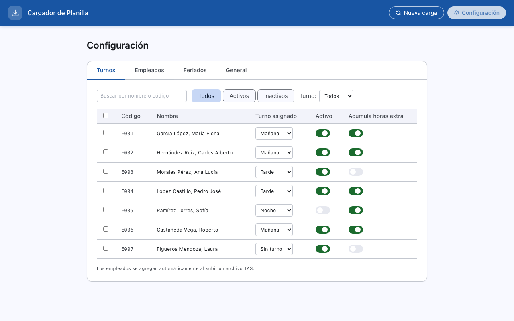

En esta pestaña puede ver y administrar todos los empleados registrados en el sistema.

**Filtros disponibles:**
- **Todos / Activos / Inactivos:** Filtra por estado del empleado.
- **Turno:** Menú desplegable para filtrar por turno asignado.
- **Búsqueda:** Campo para buscar por nombre o código.

**Columnas de la tabla:**

| Columna | Descripción |
|---------|-------------|
| **Código** | Código del empleado |
| **Nombre** | Nombre completo |
| **Turno asignado** | Menú desplegable para cambiar el turno del empleado |
| **Activo** | Interruptor para activar o desactivar al empleado |
| **Acumula horas extra** | Interruptor para indicar si el empleado acumula horas extras |

**Asignación masiva de turnos:**
1. Seleccione varios empleados usando las casillas de verificación a la izquierda de cada fila.
2. Use el control de asignación masiva para cambiar el turno de todos los seleccionados a la vez.

> **Nota:** Los empleados se agregan automáticamente al sistema cuando aparecen por primera vez en un archivo TAS. No es necesario crearlos manualmente.

### Feriados

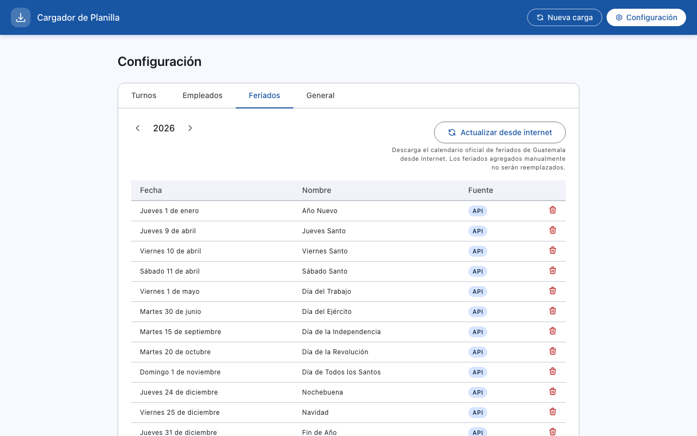

En esta pestaña puede ver y administrar los días feriados del año. Los feriados afectan el cálculo de horas extras (el trabajo en feriados generalmente genera horas extras dobles).

**Navegación por año:**
Use las flechas **"<"** y **">"** junto al año para moverse entre años.

**Actualizar desde internet:**
Haga clic en **"Actualizar desde internet"** para descargar el calendario oficial de feriados de Guatemala. Los feriados agregados manualmente no serán reemplazados.

**Columnas de la tabla:**

| Columna | Descripción |
|---------|-------------|
| **Fecha** | Fecha del feriado (día de la semana y fecha) |
| **Nombre** | Nombre del feriado |
| **Fuente** | Origen del feriado: **API** (descargado de internet) o **Manual** (agregado por el usuario) |

**Agregar un feriado manual:**
Puede agregar feriados que no aparecen en el calendario oficial (por ejemplo, asuetos especiales de la empresa).

**Eliminar un feriado:**
Haga clic en el ícono de basura a la derecha del feriado para eliminarlo.

### General

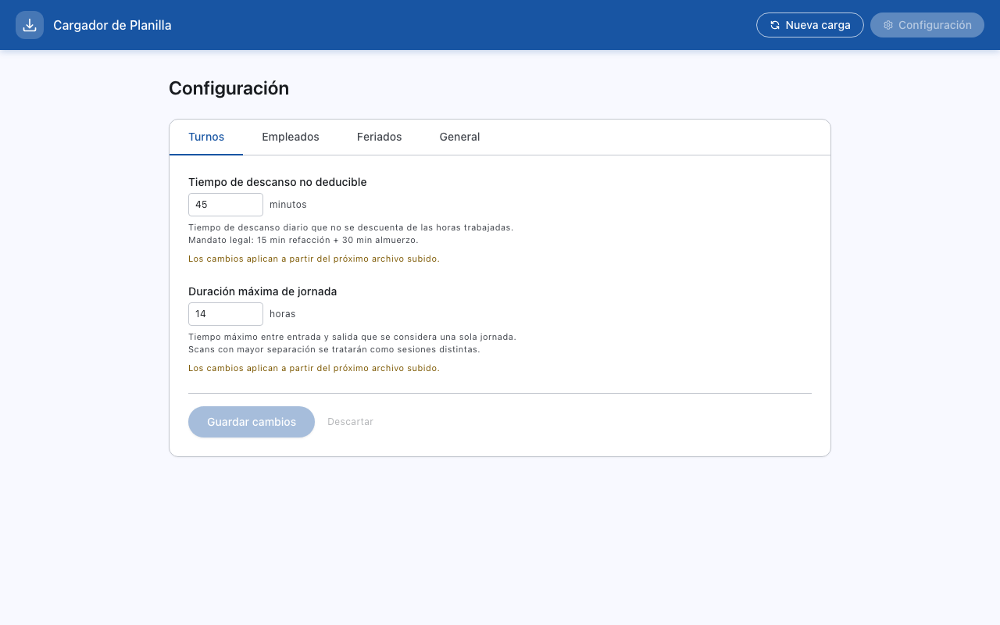

En esta pestaña se configuran parámetros generales que afectan el procesamiento de marcaciones.

**Tiempo de descanso no deducible:**
- **Valor predeterminado:** 45 minutos
- **Qué es:** Es el tiempo de descanso diario (15 minutos de refacción + 30 minutos de almuerzo) que no se descuenta de las horas trabajadas. Este es un mandato legal.
- **Ejemplo:** Si un empleado trabaja de 06:00 a 14:00 (8 horas), no se le descuentan los 45 minutos de descanso, y se registran 8 horas completas.

**Duración máxima de jornada:**
- **Valor predeterminado:** 14 horas
- **Qué es:** El tiempo máximo entre una marcación de entrada y una de salida que se considera una sola jornada de trabajo. Si la diferencia entre dos marcaciones es mayor a este valor, se tratarán como sesiones de trabajo separadas.
- **Ejemplo:** Si la duración máxima es 14 horas y un empleado marca entrada a las 06:00 y salida a las 22:00 (16 horas), la aplicación tratará esas marcaciones como dos sesiones diferentes en lugar de una sola jornada.

> **Importante:** Los cambios en esta pestaña aplican a partir del **próximo archivo subido**. No afectan los datos que ya fueron procesados.

Para guardar los cambios, haga clic en **"Guardar cambios"**. Para revertirlos, haga clic en **"Descartar"**.

---

## 8. Mensajes de error y soluciones

| Mensaje | Causa | Solución |
|---------|-------|----------|
| "El archivo no tiene el formato esperado de marcaciones TAS" | El archivo seleccionado no es un reporte TAS válido | Verifique que está usando el archivo CSV exportado directamente del sistema TAS. Archivos de Excel u otros formatos no son compatibles |
| "No se pudo procesar el archivo TAS" | El archivo está dañado o tiene un formato corrupto | Exporte el archivo nuevamente del sistema TAS. Si el problema persiste, contacte al encargado de sistemas |
| "No se pudo conectar con el servicio." | El componente interno de la aplicación no se inició | Haga clic en "Reintentar". Si no funciona, cierre y vuelva a abrir la aplicación |
| "Base de datos no disponible" | La aplicación no puede alcanzar la base de datos de la empresa | Verifique que su computadora está conectada a la red interna. Si el problema persiste, contacte al encargado de sistemas |
| "La sesión de carga expiró" | Pasó demasiado tiempo entre la carga del archivo y el envío | Vuelva a cargar el archivo y repita el proceso |
| "Se agotaron los reintentos." | Los registros fallidos no pudieron enviarse después de 3 intentos | Contacte al encargado de sistemas para verificar el estado de la base de datos |

---

## 9. Resolución de problemas

**La aplicación no abre o no responde al hacer doble clic:**
- Espere unos segundos — la aplicación puede tardar en iniciar.
- Verifique que no hay otra instancia de la aplicación ya abierta (revise la barra de tareas de Windows).
- Reinicie la computadora e intente de nuevo.

**El archivo no es reconocido al cargarlo:**
- Verifique que el archivo es un `.csv` exportado directamente del sistema TAS.
- No abra ni modifique el archivo en Excel antes de cargarlo, ya que Excel puede alterar el formato.
- Verifique que el archivo no está vacío.

**La base de datos no está disponible:**
- Verifique que el cable de red está conectado o que tiene conexión WiFi.
- Contacte al departamento de sistemas para verificar que el servidor de base de datos está funcionando.

**Los datos de un empleado parecen incorrectos:**
- Verifique que el archivo TAS corresponde al período correcto.
- En la vista de detalle, expanda las marcaciones originales (pastillas azules) para comparar con las horas calculadas.
- Si el turno asignado no es el correcto, puede ajustarlo desde la página de Configuración > Empleados.

**La aplicación se congela durante el envío:**
- No cierre la aplicación. Espere al menos 5 minutos.
- Si después de 5 minutos no hay progreso, cierre la aplicación y vuelva a abrirla.
- Al volver a cargar el archivo, los registros que ya se enviaron serán detectados como duplicados y no se enviarán de nuevo.

**Un empleado no aparece en la tabla de revisión:**
- Verifique que el empleado aparece en el archivo TAS.
- Si el empleado estaba inactivo, es posible que fue ignorado en el paso de empleados inactivos. Vuelva a cargar el archivo y seleccione "Reactivar y enviar" para ese empleado.

---

## 10. Preguntas frecuentes

**¿Puedo cargar el mismo archivo dos veces?**
Sí. La aplicación detecta automáticamente los registros que ya fueron enviados previamente y los marca como "Duplicado". Los registros duplicados serán excluidos del envío — solo se enviarán los registros nuevos.

**¿Qué pasa si cierro la aplicación durante el envío?**
No cierre la aplicación durante el envío. Si lo hace por accidente, vuelva a abrir la aplicación y cargue el archivo nuevamente. La aplicación detectará los registros que ya se enviaron como duplicados y solo enviará los que falten.

**¿Puedo editar las horas extras después de la verificación?**
Sí. En la vista de lista y en la vista de detalle puede modificar las horas extras simples y dobles directamente. Los campos editados se resaltarán en amarillo para que sepa qué valores fueron ajustados manualmente.

**¿Qué hago si el archivo abarca dos quincenas?**
Cuando el archivo TAS contiene marcaciones de más de una quincena, la aplicación le mostrará un selector de período en la pantalla de verificación. Seleccione la quincena que desea procesar. Para procesar la otra quincena, deberá volver a cargar el archivo y seleccionar el otro período.

**¿Qué significa la etiqueta "turno est." junto al nombre de un empleado?**
Significa que en uno o más días, las marcaciones de ese empleado no coincidieron con la ventana de detección de ningún turno configurado. La aplicación asignó automáticamente el turno más cercano en horario. Es recomendable revisar estos casos en la vista de detalle.

**¿Qué pasa con los empleados marcados como duplicado?**
Sus registros ya existen en la base de datos para el mismo período. La fila aparece atenuada y sus datos no se pueden editar ni enviar. Esto es normal cuando se vuelve a cargar un archivo previamente procesado.

**¿Los empleados nuevos se crean automáticamente?**
Sí. Cuando un empleado aparece por primera vez en un archivo TAS, la aplicación lo agrega automáticamente al sistema. No es necesario crearlo manualmente en la configuración.

**¿Qué formatos de archivo acepta la aplicación?**
Solo archivos `.csv` generados directamente por el sistema TAS. Archivos de Excel (`.xlsx`, `.xls`) u otros formatos no son compatibles.

**¿Se puede deshacer un envío?**
No. Una vez que los datos se envían a la base de datos, no pueden deshacerse desde la aplicación. Si envió datos incorrectos, contacte al encargado de sistemas.

**¿Por qué el interruptor "Acumula extras" de un empleado está desactivado?**
Algunos empleados no acumulan horas extras según las políticas de la empresa. Este interruptor se puede configurar en la página de Configuración > Empleados o directamente en la vista de lista durante la revisión.

---

## 11. Glosario

| Término | Definición |
|---------|------------|
| **Marcación** | Registro de entrada o salida generado por el sistema de control de asistencia TAS cuando un empleado pasa su tarjeta o huella |
| **Turno** | Horario de trabajo definido con hora de inicio y fin. Por ejemplo, "Mañana" de 06:00 a 14:00 |
| **Quincena** | Período de pago de 15 días. Quincena 1 va del 1 al 15 del mes; Quincena 2 va del 16 al último día del mes |
| **Sesión** | Un período continuo de trabajo de un empleado en un día determinado, desde su entrada hasta su salida |
| **Feriado** | Día festivo oficial o de asueto que puede afectar el cálculo de horas extras |
| **Turno estimado** | Cuando las marcaciones de un empleado no coinciden con la ventana de detección de ningún turno configurado, la aplicación asigna automáticamente el turno más cercano en horario |
| **Ventana de detección** | Rango de tiempo alrededor de un turno dentro del cual se aceptan marcaciones. Se configura con los campos "Detección antes" y "Detección después" en la pestaña de Turnos |
| **Horas extras simples** | Horas trabajadas por encima de la jornada regular en días normales |
| **Horas extras dobles** | Horas trabajadas en feriados o en condiciones que generan doble pago |
| **TAS** | Terminal de Asistencia — el sistema de reloj de marcación que genera los reportes CSV |
| **Duplicado** | Registro de un empleado que ya fue enviado previamente a la base de datos para el mismo período |

---

*Para soporte técnico, contacte al encargado de sistemas de la empresa.*
